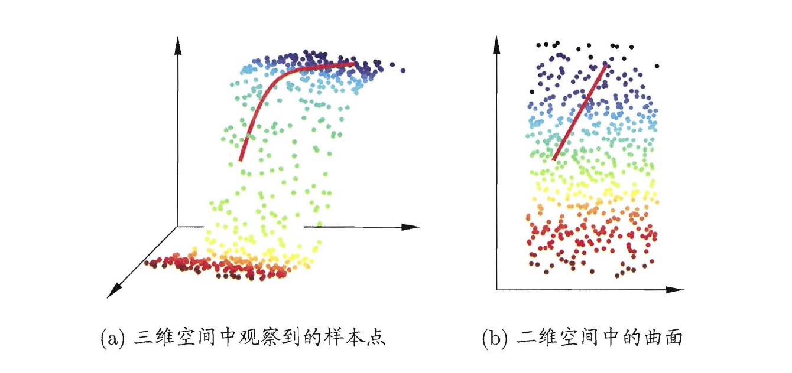

创建于 2022-01-07
关键词: 机器学习, 降维, 维数灾难.
## 为什么要降维？

考虑一个非常简单的分类器——最近邻分类器，假设样本独立同分布，且对任意测试样本$\boldsymbol{x}$和任意小的正数$\delta$，在$\boldsymbol{x}$附近$\delta$距离范围内总能找到一个训练样本，可以证明，此时的最近邻分类器的泛化错误率不超过贝叶斯最优分类器错误率的$2$倍！

以上证明结论基于一个重要假设：任意测试样本$\boldsymbol{x}$附近任意小的$\delta$距离范围内总能找到一个训练样本，即训练样本的采样密度足够大，或称为密采样(dense sample)。 然而，这个假设在现实任务中通常很难满足，例如若$\delta=0.001$，仅考虑单个属性，则至少需要$\left(10^3\right)^1=1000$个样本点平均分布在归一化后的属性取值范围内，即可使得任意测试样本在其附近$0.001$距离范围内总能找到一个训练样本，此时最近邻分类器错误率不超过贝叶斯最优分类器错误率的$2$倍。然而这只是属性维数为$1$的情形，如果属性维数为$2$，对这$2$个属性归一化后的样本空间为一个$1\times1$的正方形，此时为了让所有样本点平均分布在这个正方形的样本空间内并且邻近的样本最大距离为$0.001$，则至少需要$\left(10^3\right)^2$个样本点，同理，如果属性维数为$3$，则对这$3$个属性归一化后的样本空间为一个$1\times1\times1$的正方体，此时为了让所有样本点平均分布在这个正方体的样本空间内并且邻近的样本最大距离为$0.001$，则至少需要$\left(10^3\right)^3$个样本点，同理可推广到高维，样本空间则对应于高维空间中的超立方体，此时为了让所有样本点平均分布在高维超立方体的样本空间内并且邻近的样本最大距离为$0.001$，则至少需要$\left(10^3\right)^d$个样本点，其中$d$为属性维数，如果$d=30$，则需要$\left(10^3\right)^{30}=10^{90}$个样本，然而宇宙间基本粒子的总数也才约为$10^{80}$个。实际应用中属性维数为$30$维左右算是非常少的情况了，原始属性经常成千上万，因此要满足密采样条件所需要的样本数是无法达到的天文数字。

此外，许多学习方法都涉及距离计算或内积计算等，高维空间样本稀疏，而与距离计算有关的一般都属于非线性运算，计算时间开销大，计算困难，所有这些由于维数太高导致的问题是所有机器学习方法共同面临的严重障碍，被称为维数灾难(curse of dimensionality)。

缓解维数灾难的一个重要途径就是降维(dimension reduction)，即通过某种数学变换将原始高维属性空间转变为一个低维子空间，在这个子空间中样本密度大幅提高，距离计算也变得更为容易。

## 为什么能降维？

在很多时候人们观测或是收集到的数据样本虽然是高维的，但是与学习任务密切相关的也许仅是某个低维分布，即高维空间中的一个低维嵌入(embedding)。下图给出了一个直观的例子，原始高维空间中的样本点，在这个低维嵌入子空间中更容易学习。

若要求原始空间中所有样本两两之间的距离在低维空间中得以保持，如上图所示，即得到多维缩放(Multiple Dimensional Scaling, MDS)这样一种经典的降维方法。

## 有哪些常见的降维算法？

常见的降维算法有：多维缩放(Multiple Dimensional Scaling, MDS)、主成分分析(Principal Components Analysis, PCA)、核主成分分析(Kernelized Principal Components Analysis, KPCA)、等度量映射(Isometric Mapping, Isomap)、局部线性嵌入(Locally Linear Embedding, LLE)、线性判别分析(Linear Discriminant Analysis, LDA)、核线性判别分析(Kernelized Linear Discriminant Analysis, KLDA)、t分布随机近邻嵌入(**t-Distributed** Stochastic Neighbor Embedding, t-SNE)等。

## 参考文献

[1] 周志华. 机器学习[M]. 清华大学出版社, 2016.
[2] 刘家锋, 刘鹏, 张英涛等. 模式识别[M]. 哈尔滨工业大学出版社, 2017.
[3] Van der Maaten L, Hinton G. Visualizing data using t-SNE. Journal of machine learning research. 2008 Nov 1;9(11).

